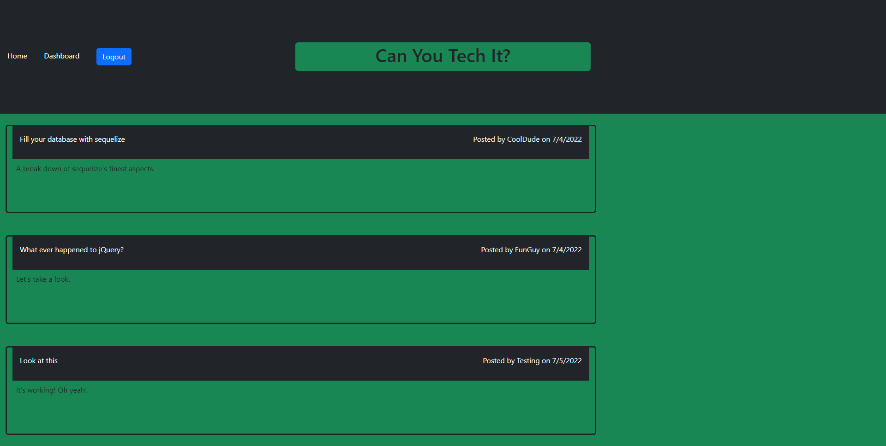
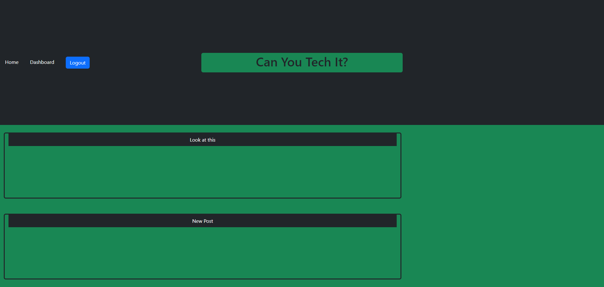

# Tech Blog

## Table of Contents
1. [Description](#description)
2. [Usage](#usage)
3. [Visuals](#visuals)
4. [Resources](#resources)

## Description

A tech blog that allows a user to sign up, then post, update, and delete their blogs. Users can also comment on blog posts.

Features Include:

- Use of the MVC paradigm
- Express, Handlebars, Sequelize, dotenv, bcrypt, and express-session

## Usage

On the homepage, user must first sign up or login before viewing the blogs in detail. They will be redirected to the login page to do so. After logging in, user can click the dashboard and click New Post to create a new blog. To update or delete a blog, user can click on one of their listed blogs. On the homepage when logged in, a user can click on a specific blog to add a comment.

## Visuals
An image of the blog's homepage.

An image of the blog's dashboard.

## Resources

- [Repository](https://github.com/kleylakb89/14-tech-blog)
- [Heroku Site](https://morning-refuge-95641.herokuapp.com/)